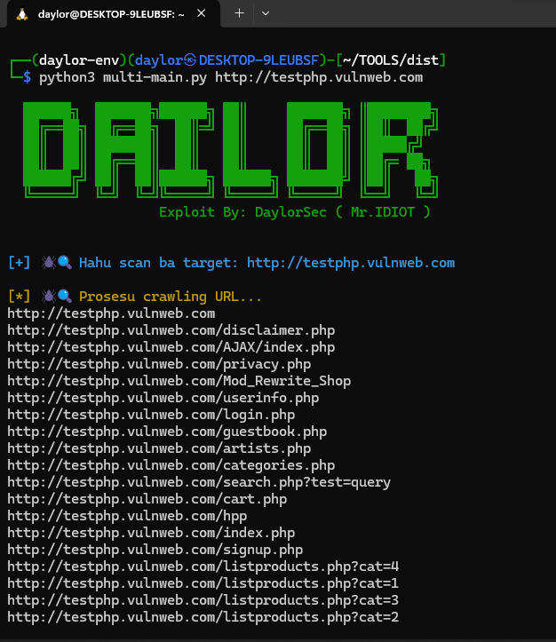
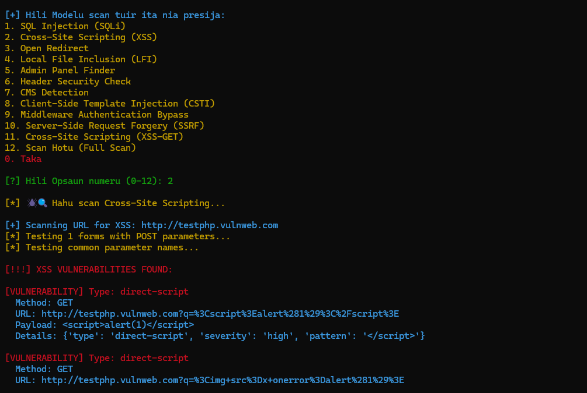

# 🔍 Web Vulnerability Scanner Toolkit

 

A multi-module security assessment tool for identifying vulnerabilities in web applications, with Tor anonymity support.

## 🌟 Features

### 🕵️‍♂️ Discovery Modules
| Module | Description | Tech Used |
|--------|-------------|-----------|
| **Crawler** | Advanced URL discovery with JS analysis | BeautifulSoup, Threading |
| **Admin Finder** | 50+ common admin panel paths | Requests |
| **CMS Detector** | WordPress, Joomla, Drupal identification | Signature matching |

### 🔬 Vulnerability Scanners
| Vulnerability | Detection Method | Payload Count |
|--------------|------------------|--------------|
| SQL Injection | Error-based, Time-based, Boolean | 25+ payloads |
| XSS (Reflected/DOM) | Context-aware payloads | 50+ variations |
| LFI | Path traversal, wrappers | 40+ techniques |
| SSRF | Internal endpoint testing | 8 targets |
| Open Redirect | 10+ bypass techniques | URL manipulation |
| CSTI | Template engine detection | 15+ payloads |

### 🛡️ Security Checks
- Header Security Analysis (CSP, HSTS, etc.)
- Middleware Bypass (12+ header techniques)
- WAF Detection (Cloudflare, Akamai)

## 🛠 Installation

### Prerequisites
- Python 3.8+
- Tor service

### Setup
```bash
# Clone repository
git clone https://github.com/Inaciojmd/Web-recon.git
cd Web-recon
```

# Create a Virtual Environment
```
python3 -m venv daylor-env
source /home/daylor/TOOLS/daylor-env/bin/activate
```
# Install dependencies
```
pip install -r requirements.txt
```

# Usage
```
python3 multi-main.py https://example.com
```

# Configure Tor (Linux)
```
sudo apt install tor
sudo systemctl start tor
```

### ⚠️ STRICT DISCLAIMER – READ CAREFULLY

This software is intended solely for educational and ethical testing purposes. Unauthorized use of this tool is strictly prohibited. By using this software, you agree that:

1. You are fully responsible for any actions taken with it.

2. The developers and contributors will not be held liable for any form of damage, misuse, or legal consequences arising from its use.

3. You must have explicit permission before testing or assessing any system, network, or device.

4. Any use of this tool against systems you do not own or lack authorization for is likely illegal and unethical.

Misuse can lead to criminal prosecution. Use wisely, use legally, and use responsibly.
